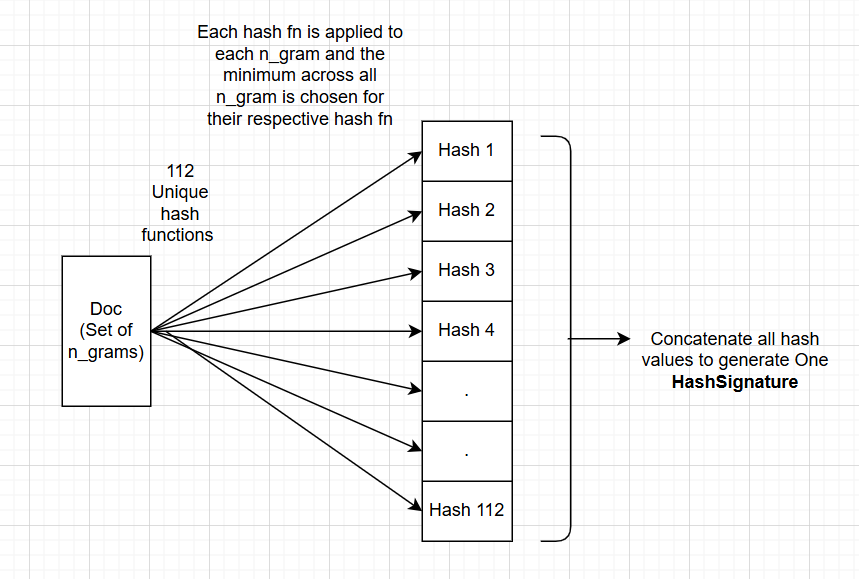
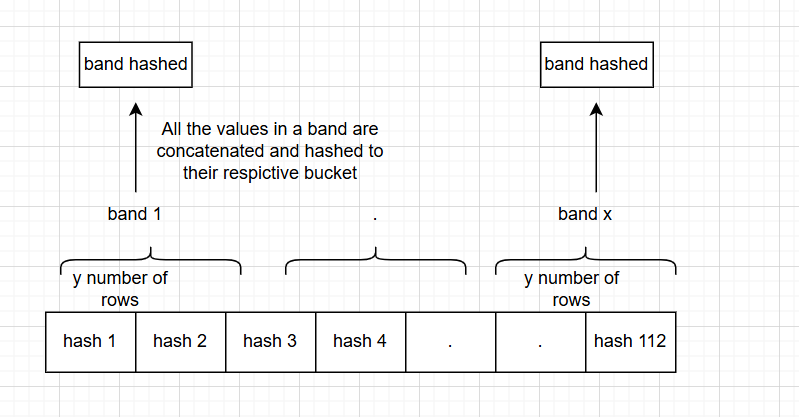

# Implementing Deduplication Method in FineWeb

## 🎯 AIM

Recreate the deduplication strategy used in the [FineWeb](https://huggingface.co/papers/2404.07143) dataset pipeline for English pretraining data. The goal is to:

- Efficiently identify near-duplicate documents
- Cluster them using MinHash + Locality-Sensitive Hashing (LSH)
- Visualize the resulting clusters to verify grouping quality

This project uses a simplified implementation on a small dataset (e.g., 700 documents + 300 duplicates) to make the concepts and mechanics approachable.

---

## 🧱 N-gram Generation

We begin by converting each document into a set of **5-grams**. For example:

```text
Sentence: "the quick brown fox jumps over"

5-grams:
- the quick brown fox jumps
- quick brown fox jumps over
```

Each n-gram is treated as a set element and will be passed through multiple hash functions for signature generation.

---

## 🔐 MinHash Signature

For each document, we generate a **MinHash signature** using 112 hash functions.

This signature represents an approximation of the document's n-gram set and is much more memory efficient than storing raw shingles.


Each entry in the signature is the minimum hashed value of any n-gram under a given hash function.


---

## 🪣 Locality-Sensitive Hashing (LSH)

We divide the 112-length MinHash signature into **14 bands**, each containing 8 rows. For each band:

- We hash the band
- Place the document into a hash bucket indexed by (band\_id, band\_hash)


If two documents share a band bucket, they are likely similar. This drastically reduces the number of pairwise comparisons.

---

## 🧠 Clustering

We use an inverted index to build a graph of documents connected through shared buckets.

- We treat documents as nodes
- If two docs share a bucket, we connect them
- We use BFS to extract **connected components** — each component is a **cluster** of near-duplicate documents


This visualization makes it clear which documents the LSH strategy grouped together.

---

## 🧪 Results

Using 5 unique documents + 300 duplicates:

- Formed 5 clear clusters
- Cluster membership was highly accurate
- Visualization confirmed distinct, dense groupings

---

## 📁 Project Structure

```
├── lsh_dedup.py              # Main pipeline (ngram → signature → LSH → clustering)
├── visualize.py              # Graph visualization logic
├── notebook.ipynb           # Exploratory Jupyter view
├── assets/
│   ├── minhash_example.png  # Signature diagram
│   └── clustering_graph.png # Final cluster plot
└── README.md                # You are here
```

---

## 🚀 Run It Yourself

```bash
pip install -r requirements.txt
python lsh_dedup.py
```

You can tweak the dataset size, number of bands/hash functions, or visualization size in the script.

---

## 🙌 Acknowledgments

Inspired by Hugging Face's [FineWeb paper](https://huggingface.co/papers/2404.07143). This educational reimplementation is aimed at helping students understand large-scale data curation for LLM pretraining.

---

## 📫 Let’s Connect

If you're working on dataset pipelines, LLM deduplication, or retrieval-augmented systems, feel free to [reach out](https://www.linkedin.com/) or open a GitHub issue/discussion!

---

